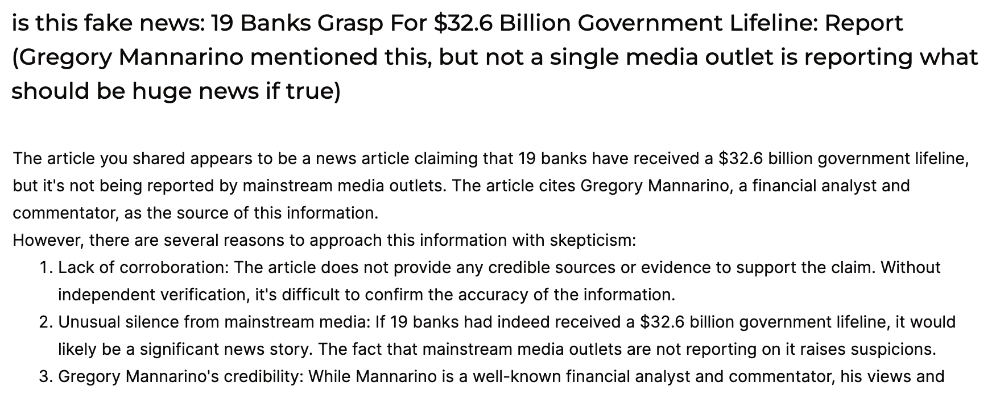
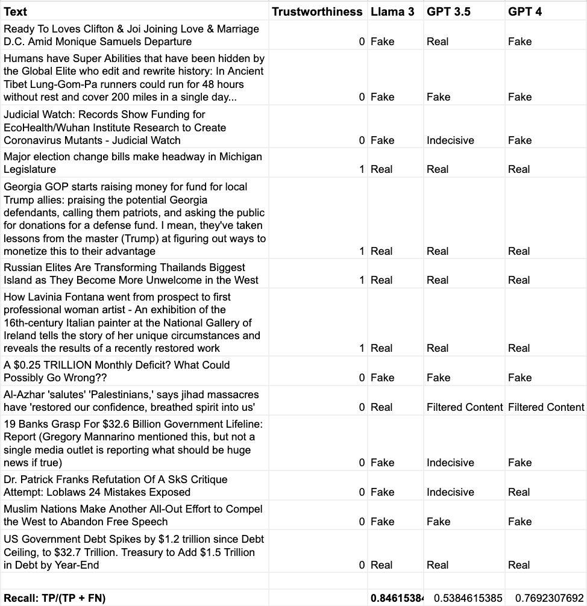

# Predicting Disinformation on Reddit
*Project for CS7290*

## Project Summary
This project set out to explore a computational method of predicting Fake News on social media. The project focuses on Reddit as a choice of social media for exploration with an aim to maximise Recall. An imbalanced dataset of reddit posts and their trustworthiness scores curated by a researcher at the Northeastern University Network Science Institute is used for binary classification. The project explores various Scikit Learn algorithms for text classification, resulting in Support Vector Classifier as a strong model giving a recall of 61% on the validation data set and 63% on the test data set. The project then went further to explore large language models (LLMs) and achieved a result of 84.6% with Zero-Shot prompting on Llama 3.

## Introduction
Fake news is any news that are untrue or exaggerated, especially with the intent of promoting a specific agenda, misleading decisions, causing social division or opposition.
Social networks have slowly become the preferred means of communication for connecting citizens and governments. Social media helps to speed up and circulate communication.
Unfortunately, this channel has also been used by some individuals and governments to systematically propagate disinformation, influencing the opinions of citizens to benefit their own interests.

This project makes use of a content-based methodology to detect fake news on social media using Reddit as its focus. **The main aim of the project will be to get as high a Recall (True Positive Rate) as possible without totally sacrificing Precision.**

This repository houses code notebooks used in this project

## Methodology

The baseline was established using the popular TfIdf with a simple sklearn classification algorithm.

The following algorithms were evaluated:
* Logistic Regression
* Stochastic Gradient Descent Classifier (SGD Classifier)
* Support Vector Classifier (SVC)
* Multinomial Naïve-Bayes classifier (MNB)

Large language model were then explored to evaluate performance. GPT 3.5 Turbo and GPT 4 were both accessed through Azure OpenAI API. Llama 3 was accessed through Groq.

#### Llama 3 on Groq

## Results

#### SVC on Validation Set

#### Comparing Llama 3, GPT 3.5 Turbo, and GPT 4

